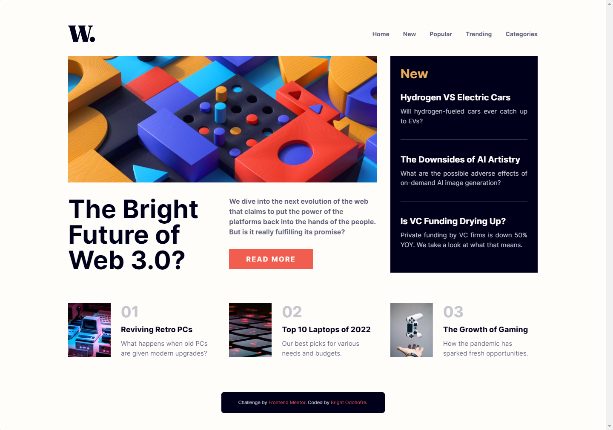
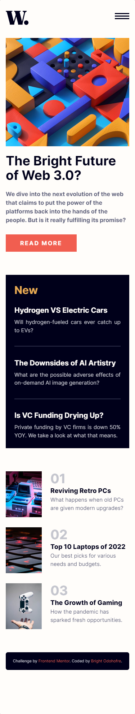

# Frontend Mentor - News homepage solution

This is a solution to the [News homepage challenge on Frontend Mentor](https://www.frontendmentor.io/challenges/news-homepage-H6SWTa1MFl). Frontend Mentor challenges help you improve your coding skills by building realistic projects.

## Table of contents

- [Overview](#overview)
  - [The challenge](#the-challenge)
  - [Screenshot](#screenshot)
  - [Links](#links)
- [My process](#my-process)
  - [Built with](#built-with)
  - [What I learned](#what-i-learned)
  - [Useful resources](#useful-resources)
- [Author](#author)

**Note: Delete this note and update the table of contents based on what sections you keep.**

## Overview

### The challenge

Users should be able to:

- View the optimal layout for the interface depending on their device's screen size
- See hover and focus states for all interactive elements on the page

### Screenshot




### Links

- Solution URL: [Github repo](https://github.com/Odohofre/news-homepage)
- Live Site URL: [Live Site](https://news-homepage-gilt-one.vercel.app/)

## My process

### Built with

- Semantic HTML5 markup
- CSS custom properties
- Flexbox
- CSS Grid
- Mobile-first workflow
- [React](https://reactjs.org/) - JS library
- [Tailwind CSS](https://www.tailwindcss.com/) - CSS framework

### What I learned

- I learnt how to use `useRef` and `useEffect` hooks
- I learnt how to close a components wheneve I click outside of it.

To see how you can add code snippets, see below:

```javascript
 const handleClickOutside = (event) => {
    if (menuRef.current && !menuRef.current.contains(event.target)) {
      handleLinkClick();
    }
  };

```

### Useful resources

- [NEW ReactJs docs](https://beta.reactjs.org/learn)
- [CSS-TRICKS blog on CSS Grid](https://css-tricks.com/snippets/css/complete-guide-grid/) - This is an amazing article which helped me finally understand CSS Grid. I'd recommend it to anyone still learning this concept.
- [ChatGPT](ai.com) - This helped me code better

## Author

- Website - [Bright Odohofre](https://odohofre.github.io)
- Frontend Mentor - [@Odohofre](https://www.frontendmentor.io/profile/Odohofre)
- Twitter - [@B_Odohofre](https://www.twitter.com/B_Odohofre)
